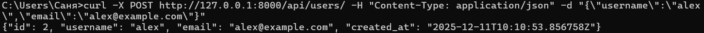
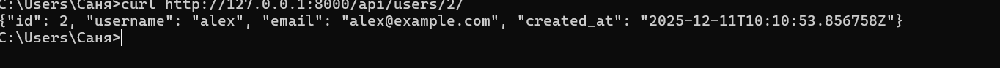
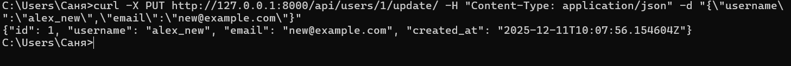

#Django
Выполнил: Портнов Александр П-211
###Использовал для тестов и проверки Curt
## Тесты
### POST /api/users/

### GET /api/users/1/

### PUT /api/users/1/update/

### DELETE /api/users/1/delete/
